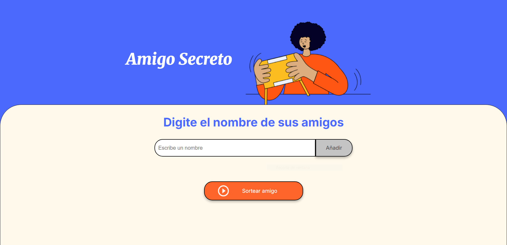

# 🎁 Amigo Secreto

Una aplicación web sencilla y divertida para organizar tu sorteo de **Amigo Secreto** de forma fácil y rápida. Agrega los nombres de tus amigos, haz clic en "Sortear" y descubre quién te tocó de manera aleatoria.

Ideal para celebraciones, fiestas de fin de año, regalos solidarios o cualquier ocasión en la que quieras intercambiar regalos con sorpresa.

---

## 🖼 Captura de pantalla

---

## 🚀 Características

- ✅ Agrega fácilmente los nombres de los participantes.
- 🎯 Interfaz limpia e intuitiva.
- 🧩 Código con manejo de nombres vacíos.

---

## 🛠 Tecnologías utilizadas

- **HTML5** – Estructura semántica.
- **CSS3** – Estilos con variables personalizadas y diseño responsivo.
- **JavaScript** – Lógica del sorteo y manipulación del DOM.

---

## 📦 Cómo usarlo

Para utilizarlo, acceda al siguiente [enlace](https://D13g053.github.io/Amigo-Secreto).

---

Este proyecto forma parte del Programa ONE – Oracle Next Education: GRUPO 9